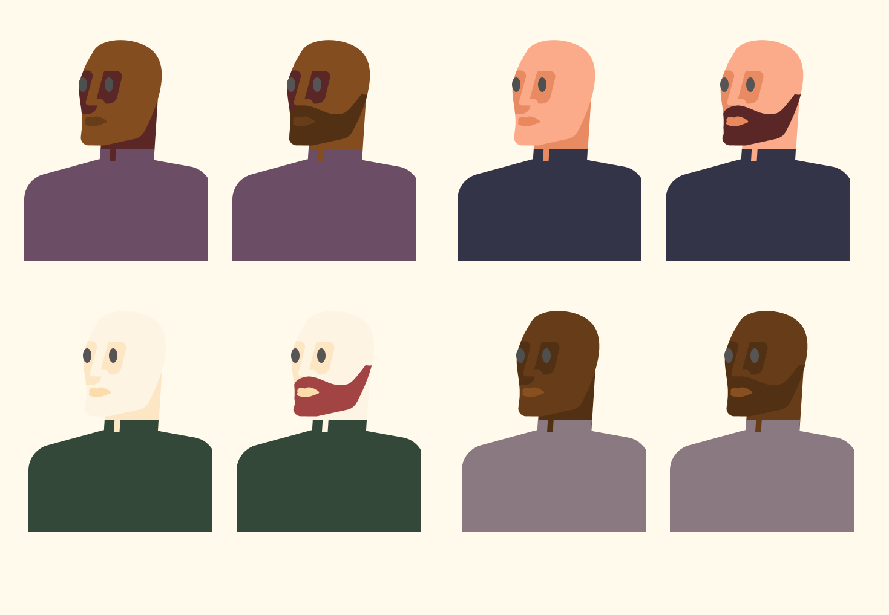

# Rob Bailey Inspired Character Illustration

## What is this?

It goes without saying that in any sort of production to stay marginally competitive one must set aside a bit of time to see what is "trending" or about to trend. It was during one of these forays perusing [Pinterist](https://www.pinterest.com/) that I found [Rob Bailey](https://www.outlineartists.com/rob-bailey). I really dug their take on flat art. The color palettes are captivating and complimentary extending the piece's story. The character contours are organic and bring a degree of depth that I found wonderful.

So the next time I needed a break for the grind I opened my [Figma](https://www.figma.com/) and decide to give the style a shot and here are the results.

## Why is this an important and interesting exercise?

 

> "Imitate until you can innovate." - Lucas

1. I find trying to emulate and pivot on illustration, design, app, etc is the best way to learn.
2. In the process of trying to recreate nine times out of 10 you learn some new technique
3. By going through the motions of another style I now have a new experience to pull from the next time a project needs some illustration on the fly.

### Tribute

I the sharing spirit of the internet here is [Rob Bailey](https://www.outlineartists.com/rob-bailey) official. So thanks for the diversion Rob. 🍻
